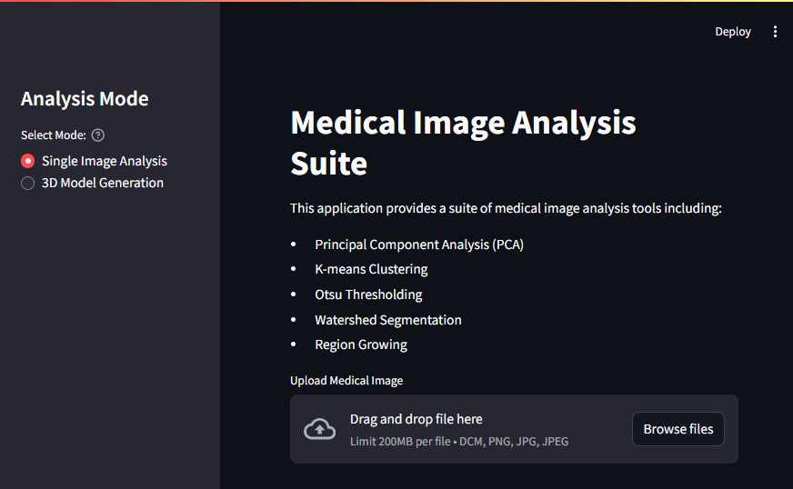
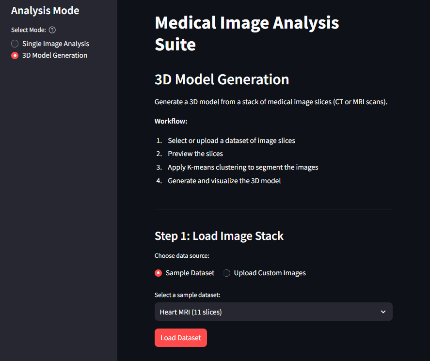
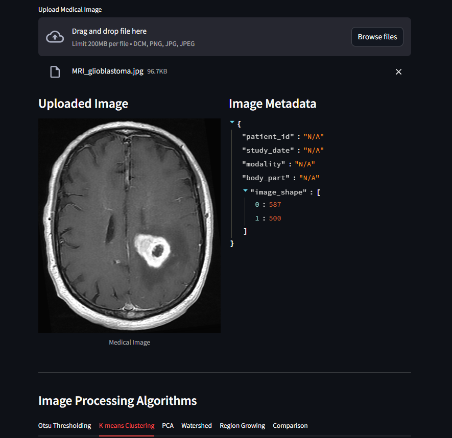
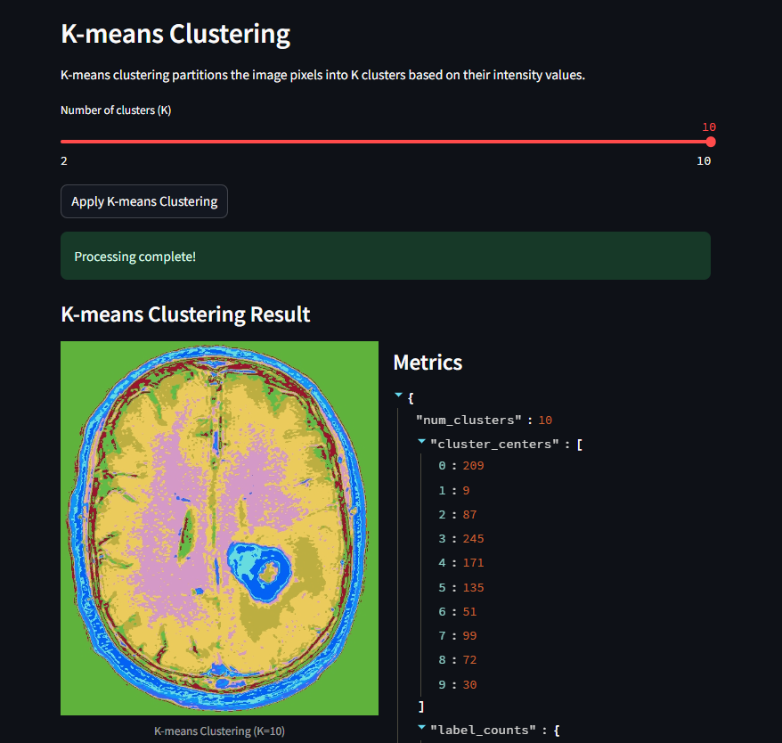
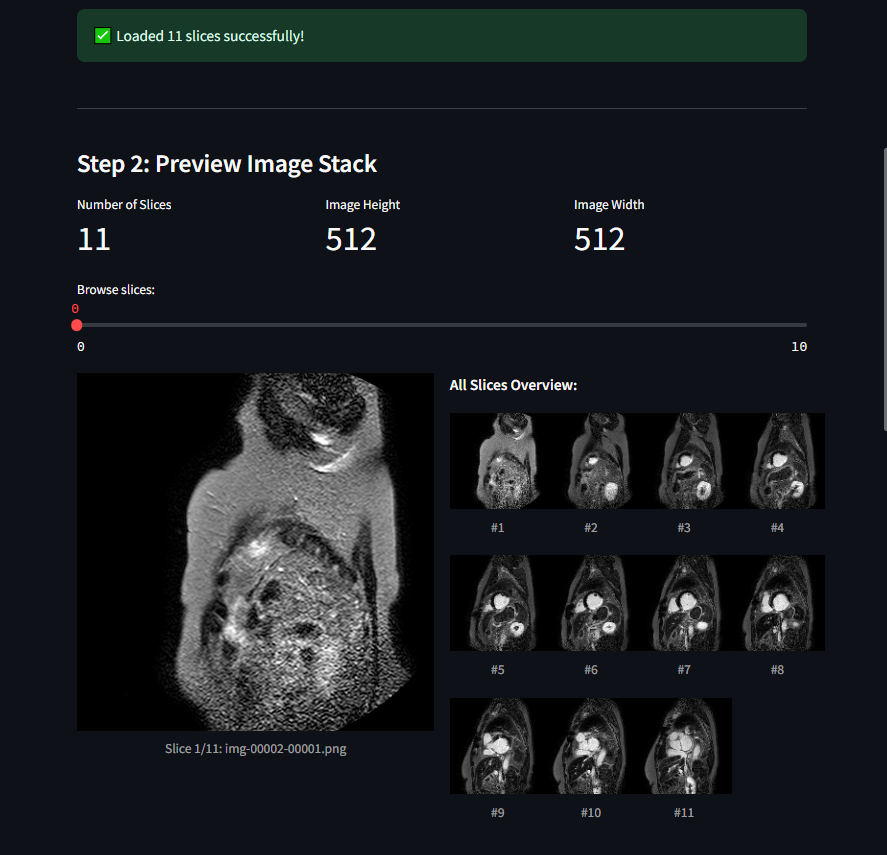
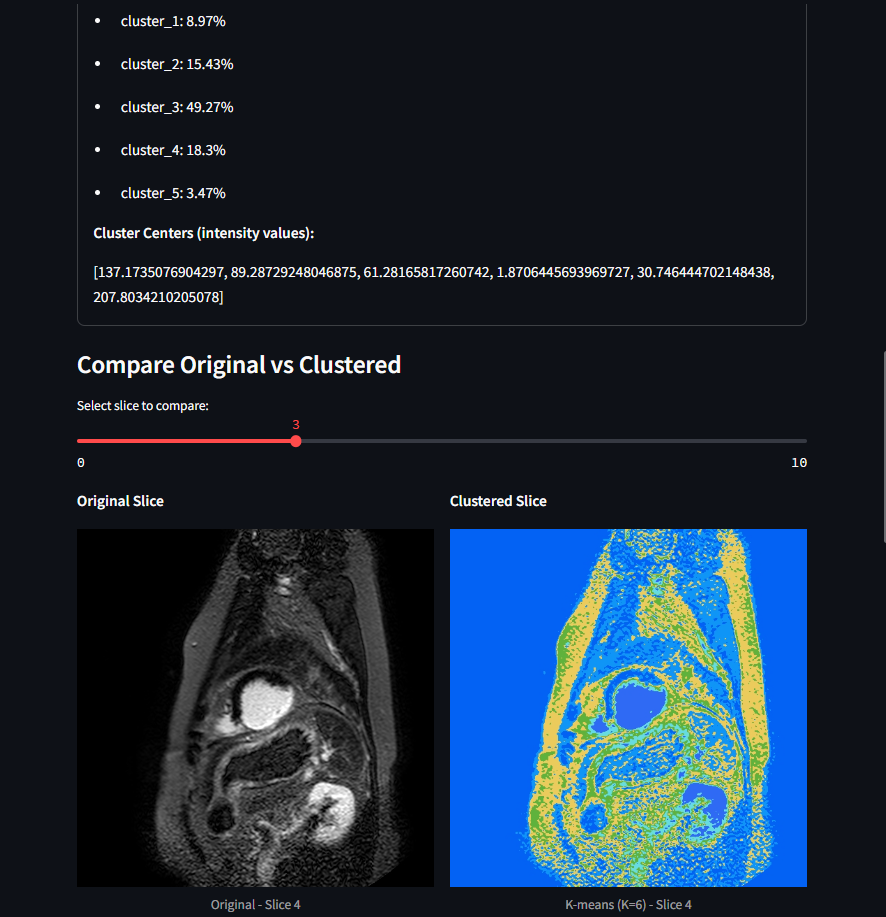
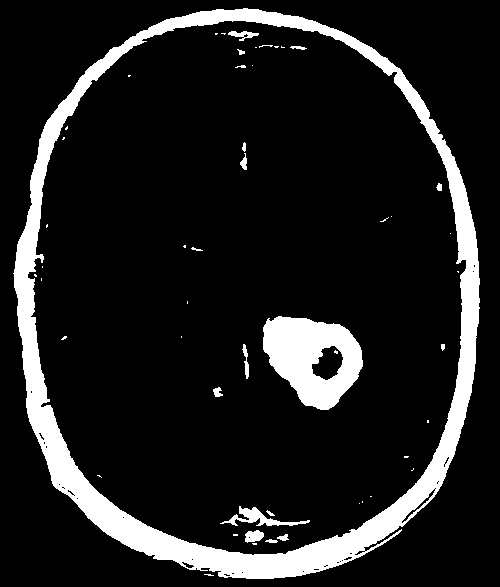
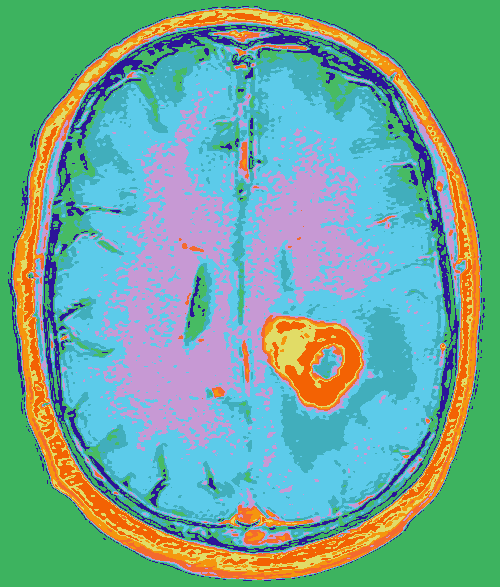

# 🏥 Medical Image Analysis Suite

A comprehensive, modular, and cross-platform web application for medical image analysis and 3D visualization, implemented in Python with Streamlit.

## 🌟 Features

### Single Image Analysis
- **Principal Component Analysis (PCA)** - Dimensionality reduction and image reconstruction
- **K-means Clustering** - Unsupervised segmentation based on pixel intensity
- **Otsu Thresholding** - Automatic binary thresholding
- **Watershed Segmentation** - Marker-based image segmentation
- **Region Growing** - Seed-based segmentation technique
- **Algorithm Comparison** - Quantitative comparison between algorithms


### 3D Model Generation
- **Multi-slice image stack loading** - Load CT/MRI scan series
- **3D K-means clustering** - Segment entire volume consistently
- **3D mesh generation** - Marching cubes algorithm with smoothing
- **Interactive 3D visualization** - Rotate, zoom, pan with Plotly
- **Cluster selection** - Show/hide individual tissue regions
- **Sample datasets included** - Heart MRI (11 slices), Chest CT (8 slices)


## 🛠️ Installation

1. Clone the repository:
   ```bash
   git clone <repository-url>
   cd MedicalImageAnalysis.Web.Py
   ```

2. Create and activate a virtual environment:
   ```bash
   # Windows
   python -m venv MedIMgAnalyze.Web
   MedIMgAnalyze.Web\Scripts\activate
   
   # macOS/Linux
   python3 -m venv MedIMgAnalyze.Web
   source MedIMgAnalyze.Web/bin/activate
   ```

3. Install the required dependencies:
   ```bash
   pip install -r requirements.txt
   ```

## ▶️ Usage

Run the Streamlit application:

```bash
(venv) PS \MedicalImageAnalysis.Web.Py> streamlit run app.py

  You can now view your Streamlit app in your browser.

  Local URL: http://localhost:8501
  Network URL: http://10.239.39.225:8501
```

Then open your browser to the URL provided in the terminal (typically http://localhost:8501).

### Analysis Modes

Use the sidebar to switch between:

1. **Single Image Analysis** - Process individual medical images with various algorithms



2. **3D Model Generation** - Create interactive 3D models from image stacks



## 📁 Supported File Formats

- DICOM (.dcm)
- PNG (.png)
- JPEG (.jpg, .jpeg)
- BMP (.bmp)
- TIFF (.tif, .tiff)

## 📂 Project Structure

```
MedicalImageAnalysis.Web.Py/
├── app.py                    # Main Streamlit application
├── requirements.txt          # Python dependencies
├── README.md                 # This file
├── services/                 # Image processing algorithms
│   ├── otsu.py               # Otsu thresholding
│   ├── kmeans.py             # K-means clustering (2D & 3D stack)
│   ├── pca.py                # Principal Component Analysis
│   ├── region_growing.py     # Region growing segmentation
│   ├── watershed.py          # Watershed segmentation
│   ├── comparison.py         # Algorithm comparison metrics
│   ├── volume3d.py           # 3D volume operations & mesh generation
│   └── visualization3d.py    # Plotly 3D visualization
├── utils/                    # Utility functions
│   ├── dicom_loader.py       # DICOM file loading
│   └── image_io.py           # Image I/O & stack loading
├── static/                   
│   └── images/               # Processed image outputs
├── Heart_PNGs/               # Sample dataset: Heart MRI (11 slices)
├── CT_Breast_chest_PNGs/     # Sample dataset: Chest CT (8 slices)
└── tests/                    
    ├── test_services.py
    └── test_comparison.py
```

## 🔬 Algorithms

### Single Image Processing

#### Otsu Thresholding
Automatically determines the optimal threshold value by maximizing inter-class variance. Produces a binary mask separating foreground from background.
<!--  -->

#### K-means Clustering
Partitions image pixels into K clusters based on intensity values. Configurable K (2-10) with colorized output for visualization.
<!--  -->

#### Principal Component Analysis (PCA)
Transforms image data to principal components, allowing reconstruction with reduced dimensionality. Useful for noise reduction and compression analysis.
<!--  -->

#### Watershed Segmentation
Treats the image as a topographic surface, using distance transforms and markers to identify distinct regions.
<!--  -->

#### Region Growing
Expands from a seed point, adding neighboring pixels within a tolerance threshold. Configurable tolerance (1-50).
<!--  -->

#### Algorithm Comparison
Quantitative comparison using metrics:
- Mean/Std intensity
- Entropy (information content)
- Edge density
- Min/Max values
- Pairwise percentage differences

### 3D Model Generation

#### Image Stack Loading
- Natural sorting of slice filenames
- Automatic dimension validation
- Support for sample datasets or custom uploads

#### 3D K-means Clustering
- Global clustering across entire volume (consistent segmentation)
- Configurable K (2-6 recommended)
- Volume percentage calculation per cluster
- Side-by-side original vs. clustered comparison

#### Mesh Generation (Marching Cubes)
- Converts clustered volume to 3D surface mesh
- Optional Gaussian smoothing (reduces staircase artifacts)
- Per-cluster mesh generation
- Statistics: vertex count, triangle count, volume percentage

#### Interactive 3D Visualization
- Powered by Plotly
- Controls: rotate (drag), zoom (scroll), pan (right-click)
- Cluster legend with show/hide functionality
- Dark theme optimized for medical imaging

## 📖 Understanding the Results

### What Clusters Represent

| Intensity | CT Scan | MRI Scan |
|-----------|---------|----------|
| Low (dark) | Air, lungs | Bone, air |
| Medium | Soft tissue | Gray matter |
| High (bright) | Bone | Fat, fluid |

### Tips for Best Results

1. **Start with K=2 or K=3** for basic tissue separation
2. **Enable smoothing** for cleaner 3D models
3. **Hide background cluster** to see internal structures
4. **Use more slices** for smoother 3D reconstruction

### Limitations

- Intensity-based only (no anatomical knowledge)
- Assumes equal slice spacing
- For educational/research purposes, not clinical use

## 🤝 Contributing

1. Fork the repository
2. Create a feature branch
3. Commit your changes
4. Push to the branch
5. Create a Pull Request

## 📄 License

This project is licensed under the MIT License - see the LICENSE file for details.

## 🙏 Acknowledgments

- OpenCV for image processing
- scikit-image for marching cubes algorithm
- Plotly for interactive 3D visualization
- Streamlit for the web framework